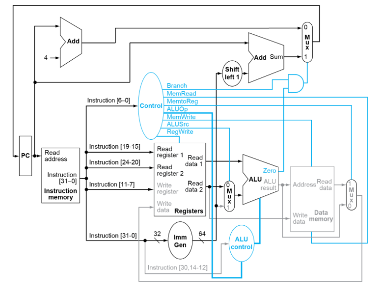

# Advanced-Processors-Final

Each student is required to do a final project which weighs 20% of your final grade. The
project goal is to use Verilog (Vivado) to implement a single-cycled processor based on the
block diagram in Figure 1. The processor should be able to execute load, store, R-type (addition,
subtraction, division, multiplication, AND, OR) and branch (BEQ) instructions.

Figure 1: Block diagram of a simplified single-cycled processor.

### Note:
* The adder of the ALU needs to be designed using structural model, and built from
bottom up, i.e., from half adder > 1-bit > 4-bit > 16-bit > 32-bit> 64-bit
* The subtractor can be designed using the 64-bit adder: A + (-B) = A - B
* For multiplier and divider, you should specify which algorithm/flowchart will be used
in your project, and you design the unit accordingly
* For other modules like logical unit, shifter, sign extension ... you can do behavioral
modeling
* Every single module in your design needs to be tested, and you should include all the
simulation waveform with explanations in your report
* For every single module in the block diagram in Figure 1, you should include a
description of the inputs, output(s) and the functionality of the module

Although the deadline for the project is 12/13/2023, every week, you are supposed to
submit on Canvas your design and simulation of the module(s) you propose the week before. If
you do not submit your weekly design and simulation every week, but the entire working
processor in the week of the deadline, you can only get a maximum of 90% for the project.
Your weekly and final project report should include:
1. Cover page:
2. Objective(s)
3. Tools/equipment/software
4. Procedure
5. Test plan
6. Results/observations
7. Conclusion

By November, each student will be emailed an expression to test your overall design.
Your simulation results should show step-by-step execution of the instructions generated to
evaluate the given expression